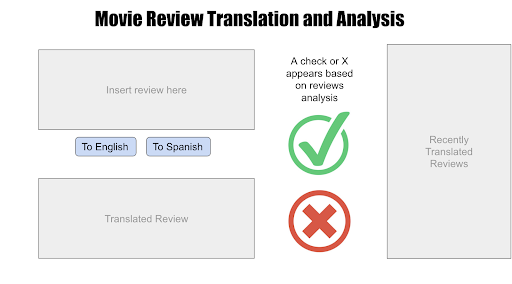

# 5290-Spanish-MTSA

## Description
Movies are something that people love across cultures and languages. By translating movie reviews between English and Spanish, we will allow more people to connect over their mutual love (or hatred) of a movie. We will perform neural machine translation to convert Spanish reviews to English, and vice versa. We will then use sentiment analysis to characterize the reviews as either positive or negative.

## Motivation
Movie reviews are a great way for viewers to explore new genres and participate in a global creative community. Film is a form of storytelling, and its message may take on different meanings when viewed through different cultural lenses. Machine translation offers an efficient way to translate digital media and the discussion around it, while sentiment analysis can help gauge reception abroad. Our goal is to facilitate and encourage inclusion in online discussions, in this case about movies. While niche, we hope to demonstrate that the techniques we use can be applied to achieve that goal in a wide range of digital environments.

## Objectives
- Implement a machine translation system to…
    - Translate Spanish movie reviews to English with high accuracy.
    - Translate English movie reviews to Spanish with high accuracy.
- Implement a sentiment analysis system that indicates whether a review is positive or negative.
- Evaluate the machine translation system by scoring how much of the original meaning of the review is kept. This will be done using the C-DAC GIST MT tool which is designed to evaluate machine translations. Adjust the model accordingly. 
- Evaluate the sentiment analysis system by comparing the predicted score (positive or negative) to the labeled score and observe a basic confusion matrix of true positives, true negatives, false positives and false negatives to evaluate what errors we may have in the model.

## UI Mockup

